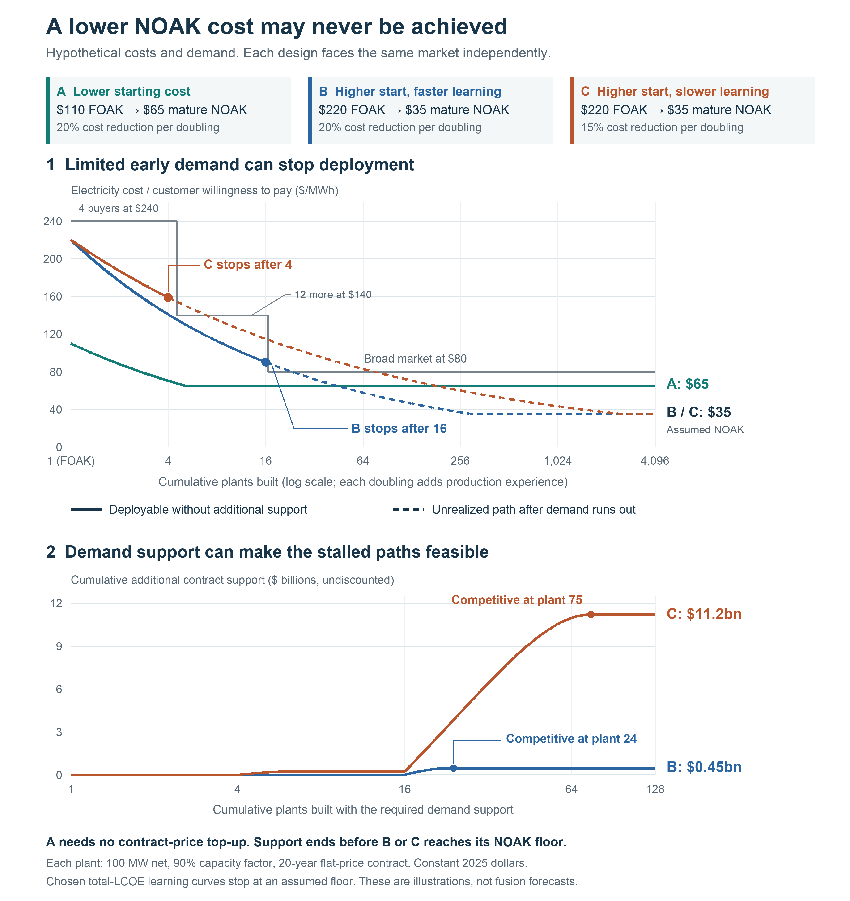
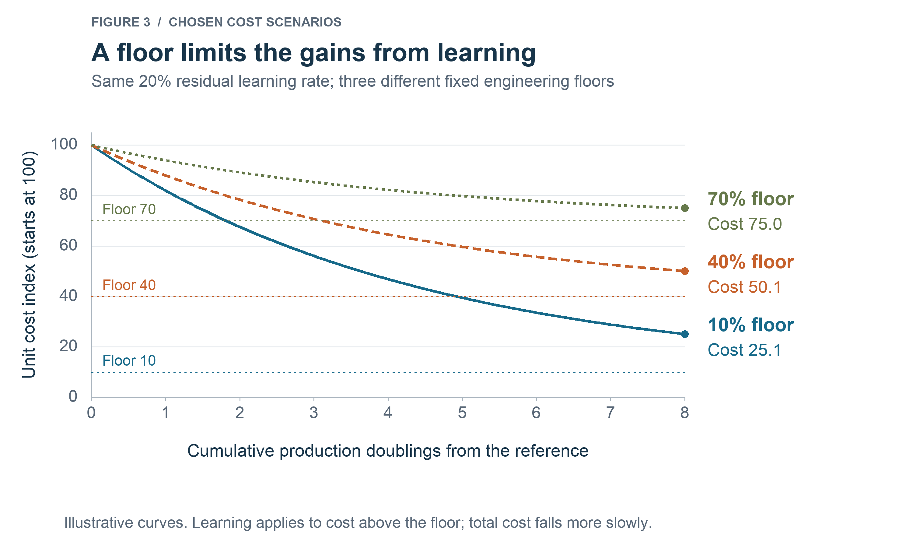
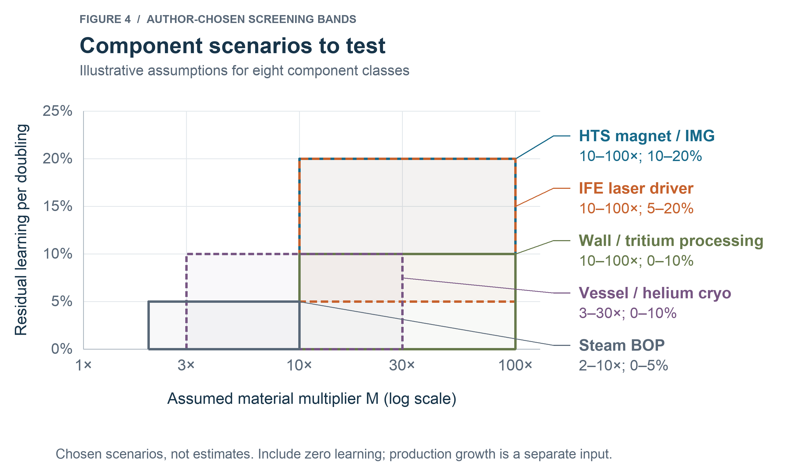
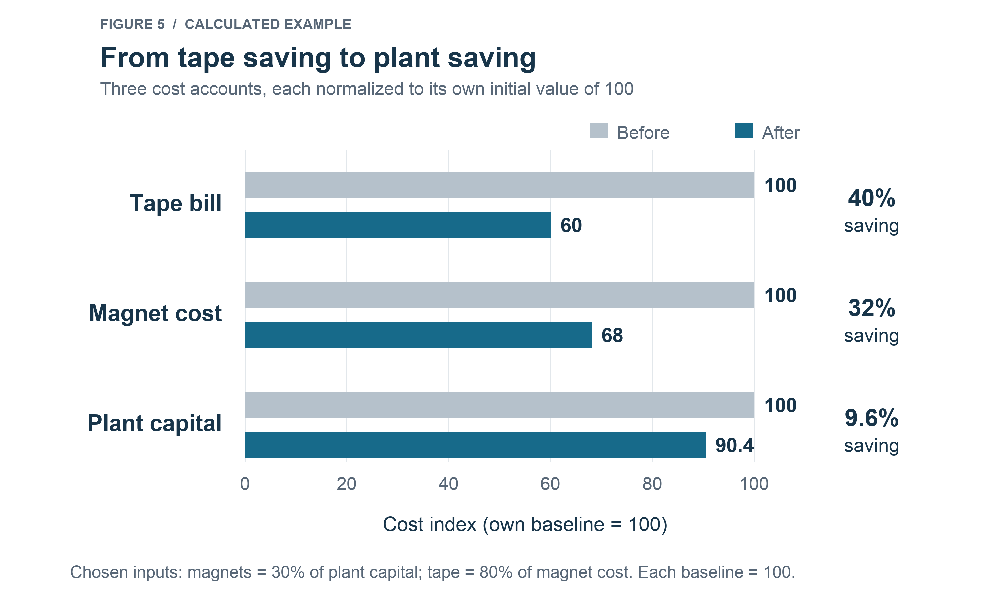
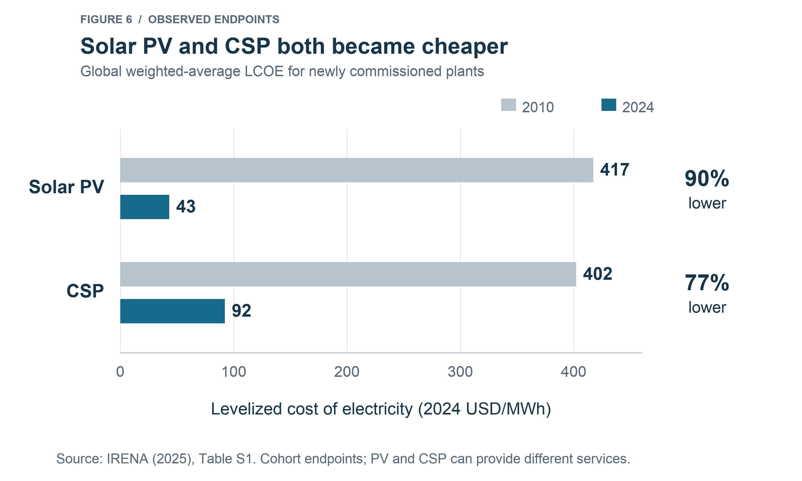

# Material Multipliers and Learning Curves

*Damien Scott · 1cFE · September 2026*

Fusion cost claims often describe two plants: the first-of-a-kind plant, or **FOAK**, and the mature nth-of-a-kind plant, or **NOAK**. The commercial question is whether we can finance, build and operate enough early plants to reach the costs claimed for later ones. In the hypothetical market of Figure 1, two designs with the same NOAK cost of $35/MWh stop after 16 and four plants without additional support, because too few customers will pay what their early plants cost. A third design, with a higher NOAK cost and a cheaper first plant, keeps selling. A competitive NOAK levelized cost of electricity, or LCOE, depends on that deployment path.

Learning rates describe cost reduction per doubling of cumulative production. A FOAK-to-NOAK projection needs a starting cost, an improvement mechanism and a production requirement. LCOE also changes with construction time, financing, availability, maintenance and net electricity output. Those changes need explicit assumptions alongside manufacturing learning.

Starting FOAK cost and achievable learning help determine whether that production can be funded. If early plants cannot compete at the price customers will pay, someone must cover the difference. Premium-paying customers, public procurement or other demand-side incentives may support those first iterations. The initial cost gap, improvement rate and available demand determine how much support is needed and for how long.

In Figure 1, design A starts at $110/MWh and falls toward $65/MWh. Designs B and C both start at $220/MWh and fall toward $35/MWh, at 20% and 15% per production doubling. All three face the same customers: four plants' worth at up to $240/MWh, twelve more at up to $140/MWh, and an unlimited market at $80/MWh. B's 17th plant would cost about $88/MWh and C's fifth about $151/MWh, so each stops where the next group of customers pays less than its next plant costs. Their dashed lines show the further cost reduction that depends on production the market does not fund.

*Figure 1. A lower NOAK cost may never be achieved. Solid lines show deployment supported by the assumed market; dashed lines show unrealized cost reductions. The lower panel sums additional support over 20-year contracts for 100 MW net plants at a 90% capacity factor, in undiscounted constant 2025 dollars. Each design faces the same demand independently. Total LCOE falls at the chosen rate per production doubling until reaching an assumed NOAK floor. All inputs are hypothetical. Support commitments stop growing when new plants become competitive; existing contracts remain payable. Inputs and calculations accompany the figure.*

Solar power became cheaper as the industry grew. US nuclear construction shows that building more plants can accompany rising costs (Eash-Gates et al., 2020). The outcome depends on design, production and transferable lessons.

For 1cFE, investigating 1¢/kWh, or $10/MWh in 2025 dollars, requires both an attainable mature cost and financeable early plants. Two numbers help: a component's **material multiplier**, which compares its finished cost with its constituent-material value, and its **accessible learning rate**, the cost reduction per production doubling supported by an applicable manufacturing process and improvement mechanism. The first identifies a premium to investigate. The second describes how it might change through production.

Brian Potter's *The Origins of Efficiency* provides a starting point. We connect that perspective with fusion components, a worked REBCO example, and the investment and demand needed to turn a FOAK-to-NOAK projection into a feasible deployment plan (Potter, 2025).

## What the material multiplier tells us

The material multiplier is the finished cost divided by the commodity value of all the materials in the component:

`M = Cfinished / Vmaterials`

Cfinished is the finished-component cost and Vmaterials is its constituent-material value, on the same price basis. M is dimensionless.

Elon Musk's name for this ratio, the "idiot index," was popularized by Walter Isaacson's 2023 biography. We use material multiplier because a high ratio can reflect necessary work. Turning ordinary elements into a reliable semiconductor, turbine blade or superconducting conductor requires processes that the commodity bill does not describe (Isaacson, 2023).

Figure 2 compares three manufactured products, using the cost and material boundaries reported by each source:

- **A steel water/process tank:** a 2015 engineering study models a 70 m³ open tank at about INR 550,000 including fabrication and overhead, against INR 398,000 of steel plate and sections. The ratio is about 1.4. The model covers fabrication from industrial steel stock (Rohini et al., 2015, Table 3).
- **A mass-produced passenger car:** a 2012 U.S. Department of Energy assessment puts selling price at about $8 per pound and raw materials at $0.60 per pound, giving about 13. The numerator includes manufacturing, shipping and commercial margins. It is an aggregate estimate (DOE, 2012, p. 25).
- **A Raptor engine nozzle jacket:** Isaacson reports a component cost of about $13,000 and an estimated steel cost of $200 in a 2021 SpaceX meeting, giving about 65. This is a reported estimate for one steel part, the half-nozzle jacket. The source does not specify whether its steel estimate covers purchased stock or material retained in the part. It does not establish a multiplier for the complete engine (Isaacson, 2023, chapter 59).

*Figure 2. Cost-to-material ratios for a steel water tank, a passenger car and a Raptor engine component. The tank uses modeled fabrication cost divided by steel-stock cost; the car uses selling price divided by a reported raw-material estimate; the nozzle jacket uses reported company estimates. These cases have different accounting boundaries. They illustrate the scale of cost above materials; they are neither comparable measures of manufacturing efficiency nor measures of removable cost. Sources, arithmetic and limitations accompany the figure.*

The car is the most instructive case for fusion: even a product made in enormous volumes can retain a substantial difference between selling price and raw-material value. That difference can pay for necessary fabrication, engineering, tooling, inspection, overhead and commercial margins. A high multiplier identifies costs to investigate; it does not tell us which can be removed.

Different parts of that premium respond to different interventions. More output spreads tooling and development expense across more units. Process redesign can remove operations, reduce scrap or improve yield. Competition can reduce a supplier's margin. Better specifications can eliminate tolerances that serve no functional purpose. Qualification and certification can become more efficient through repeatable designs and testing, while some of their underlying requirements remain. Commodity prices follow their own supply and demand. Assigning the entire premium the same improvement mechanism obscures the work needed to reduce it.

For fusion-component modeling, the material denominator should value what remains in the finished item at commodity prices. Figure 2 retains the material benchmarks its sources provide; the tank uses steel stock, and the car and Raptor use aggregate estimates. Process chemicals and material lost during manufacture belong in the manufacturing cost. A purchased-component bill already includes upstream manufacturing and gives a different ratio. Every comparison needs the finished item, its material inventory, the price period and a declared cost or selling-price basis.

For a fixed material bill, the multiplier sets a mathematical ceiling on the possible reduction: cost cannot fall by more than 1 - 1/M without going below that bill. The attainable saving is usually smaller because necessary fabrication and qualification still cost money. Changing the design or reducing material intensity changes the bill itself and needs a separate calculation.

Fusion magnets show why this distinction needs care. The material denominator includes substrate, stabilizer, structure and other constituents, as well as superconducting material. Dividing a magnet's price by the value of a few rare-earth compounds can overstate the manufacturing premium. Purchased REBCO tape already contains substantial manufacturing work. Dividing completed-magnet cost by purchased-tape cost measures assembly and procurement additions. Keeping those boundaries explicit lets us identify whether a proposal changes tape quantity, tape price or magnet fabrication.

## Wright's Law, with a floor and a production baseline

Wright's 1936 aircraft study helped establish the relationship between production experience and unit cost. In its familiar form, a learning rate of 20% means cost falls to 80% of its previous value whenever cumulative production doubles. The reductions compound: after three doublings, cost is about 51% of its starting value; after six, about 26% (Wright, 1936).

The production unit must match the cost being modeled. Labor hours per airframe, dollars per meter of conductor and plant capital per net kilowatt describe different processes. Their rates cannot be transferred just because each is expressed as a percentage. Historical experience curves summarize the combined effects of production, research, equipment investment, changing designs and market conditions. Research on technological forecasting finds that experience curves have predictive value, with substantial uncertainty, and that time-based models perform comparably (Nagy et al., 2013; Lafond et al., 2018).

Two historical estimates show why the definitions must stay attached:

- **PV modules, 1980 to 2025:** a 26.6% reduction per doubling, comparing inflation-adjusted module price per peak watt with cumulative module production in peak watts (Fraunhofer ISE, 2026a).
- **Lithium-ion cells, 1992 to 2016:** an 18.9% reduction per doubling, comparing inflation-adjusted cell price per kWh with cumulative production in MWh (Ziegler and Trancik, 2021).

These fits describe total price. They combine several sources of improvement and do not supply fusion-component learning coefficients. Cells and complete battery packs also have different cost boundaries.

The power-law form relates cost to cumulative production:

`C(Q) = C0 × (Q/Q0)^(-b)`

C0 is cost at reference cumulative production Q0. Q is later cumulative production, measured in the same units. The exponent b determines the total-cost learning rate r:

`r = 1 - 2^(-b)`

If production doubles n times in a year, the corresponding annual cost reduction is:

`Annual cost reduction = 1 - (1-r)^n`

At a 20% learning rate, three doublings leave 51.2% of the reference cost. If they happen in one year, the annual reduction is 48.8%. A rate per doubling alone says nothing about the time required.

The number of doublings from the reference production level is:

`D = log2(Q/Q0)`

Moving from 100 to 800 units provides three doublings, just as moving from one to eight does.

### Learning above an engineering floor

A constant percentage reduction eventually predicts costs below any fixed material or processing requirement. We therefore separate a component's reference cost from its engineering floor, F. The floor is the cost remaining under a stated design, performance requirement and input-price basis. A different design can have a different floor.

If the residual cost above F falls by fraction r_res per doubling:

`C(D) = F + (C0-F) × (1-r_res)^D`

A 20% reduction in the residual above the floor produces a smaller percentage reduction in total cost. A published total-cost rate r cannot be substituted for r_res and treated as the same fitted relationship.

For a target cost Ctarget, the required number of production doublings is:

`Drequired = ln[(Ctarget-F)/(C0-F)] / ln(1-r_res)`

This expression applies when F < Ctarget < C0 and 0 < r_res < 1. The model approaches F asymptotically; a lower target requires a changed floor or design.

Figure 1 uses a different whole-LCOE illustration: its total-cost curve stops at a chosen NOAK floor. Figure 3 uses the residual model above. Their learning-rate definitions are not interchangeable.

*Figure 3. All three scenarios start at cost index 100 and reduce the residual above the floor by 20% per doubling. The assumed floors are 10, 40 and 70. These are calculated scenarios. Horizontal dotted lines show the floors.*

Consider a hypothetical magnet costing $10 million, with a $200,000 constituent-material bill and a $1 million engineering floor. Its material multiplier is 50. At a 20% residual learning rate, cost reaches about $5.61 million after three doublings and $3.36 million after six. Reaching $2 million requires about 9.85 doublings, or about 920 times the reference cumulative production. A large multiplier can coexist with a demanding production requirement.

If a proposed price requires output far beyond any plausible supplier or customer market, the price assumption needs a different explanation. If the target is close to the floor, changing material intensity or the required specification may achieve more than producing many more copies of the current design. Specify that production requirement before applying a general cost discount.

## Where fusion's production experience will accumulate

A plant contains components with very different customers and production histories. We use four levels to identify where its production experience will accumulate and which existing experience it may be able to use.

### Level 1: whole-plant

Construction, installation, commissioning and coordination can improve through repeated projects. A plant built from familiar equipment can still have expensive interfaces, site requirements and commissioning problems. Whole-plant experience depends on design continuity, capable suppliers and a repeatable delivery organization. It also depends on building enough plants to retain the people and practices that improved the previous one.

### Level 2: concept-specific

Some components and assemblies serve a particular fusion approach. Their geometry, operating conditions or interfaces limit the extent to which another concept can use the same production process. Examples include specialized chamber assemblies and complete driver architectures. Their market may be concentrated in one developer's deployment program, even when they contain widely used parts.

### Level 3: cross-fusion

Several fusion approaches may share conductors, vacuum equipment, diagnostics or fuel-handling capabilities. The relevant question is how much qualified work transfers. Two customers buying tungsten do not necessarily buy interchangeable plasma-facing components. Common specifications, test methods and interfaces can make a cross-fusion market worth more to a supplier than a collection of nominally similar orders.

### Level 4: cross-industry

Fusion can buy from production systems supported by other industries. Power electronics, industrial gases, metrology and conventional power equipment are examples. A shared supplier may already have solved production problems that a fusion company would otherwise pay to solve. A large established market can also have a large cumulative-production baseline, which makes its next doubling difficult to achieve. Its current price already contains its earlier learning.

These levels locate experience. They do not rank the remaining savings. A concept-specific component with many repeatable units and a credible customer can have a stronger improvement case than a cross-industry product whose price is already close to its attainable cost. A single subsystem can span several levels: tape production, coil winding and magnet integration have different production units and different customers.

### Repetition within a plant and across plants

Modularity can provide repeated manufacturing operations before the first plant is complete. Identical assemblies let a team use one batch's results to improve the next, subject to qualification and configuration control. The cost of the first plant should sum the costs of its successive units as they are made. Pricing every unit at the final unit's cost understates it.

The production baseline still determines the doublings. If each plant contains the same number of modules, moving from one plant to two doubles both plant count and cumulative module count. More modules create repetition within a plant, but do not automatically increase the relative production growth between plants. Smaller standalone plants may reach more customers and allow staged investment while also repeating site costs, staffing and other fixed expenditure.

This is also the relevant distinction in the fusion learning-rate debate. Tang and colleagues estimate about 2% to 8% per doubling for whole-plant specific capital cost in selected magnetic and laser D-T cases, using expert judgments and historical analogies. Woodruff argues for component-level analysis using the relevant manufacturing experience. The comparison requires explicit cost accounts: Tang's whole-plant rate cannot be reassigned to installation alone while component savings are applied elsewhere. Its selected cases do not establish rates for every fusion architecture (Tang et al., 2026; Woodruff, 2026).

Our [work on translating papers into plant economics](https://1cf.energy/from-papers-to-plant-economics/) and the [1costingFE introduction](https://1cf.energy/introducing-1costingfe/) describe how those component and integration assumptions enter a common plant-cost model.

### Component assumptions to test

Figure 4 maps eight component classes using chosen material-multiplier and residual-learning bands. These are screening assumptions; they are neither measured coefficients nor supplier estimates. Every case also needs a zero-learning comparison. The rates apply per production doubling to cost above a separately justified engineering floor.

- **Finished HTS magnet:** M of 10 to 100 and residual learning of 10% to 20%. Tape production, shared tooling and concept-specific assembly offer different ways to improve yield and reduce the conductor quantity required at the specified performance.
- **Impedance-matched Marx generator (IMG) pulser assembly:** M of 10 to 100 and 10% to 20% learning. Capacitors, switches and repeated brick manufacture provide potential experience across industries and fusion developers.
- **Inertial-fusion-energy (IFE) laser driver:** M of 10 to 100 and 5% to 20% learning. Diodes and optics have broader markets, while beamlines and qualified module assembly remain design-specific.
- **First-wall or divertor assembly:** M of 10 to 100 and 0% to 10% learning. Joining, inspection and qualification must improve yield while preserving service life.
- **Vacuum-vessel assembly:** M of 3 to 30 and 0% to 10% learning. Repeat forming, welding and inspection can draw on industrial fabrication, with plant-specific sectors and site joints accounted for separately.
- **Conventional steam balance of plant:** M of 2 to 10 and 0% to 5% learning. Additional gains must exceed the supplier maturity already represented in equipment prices.
- **Helium cryogenic equipment:** M of 3 to 30 and 0% to 10% learning. Equipment and integration improvements must preserve temperature, transient-load and efficiency requirements.
- **Tritium-processing subsystem:** M of 10 to 100 and 0% to 10% learning. This means a specified fuel-processing function, such as isotope separation, storage or detritiation. It excludes the breeding blanket and fuel inventory. The production hypothesis is repeated, qualified process assemblies with the required throughput and containment.

The overlapping bands let us test how conclusions change across manufacturing assumptions. They do not establish a component ranking. Each assessment needs the finished item being purchased, its material bill, the process that could improve and the qualified production available to support that improvement. The data package retains the full component matrix and mechanism sources.

*Figure 4. Component scenarios to test. Regions reproduce the chosen bands listed above. These are scenario bands. Overlap prevents a precise component ranking. Engineering floors, cost shares and qualified performance determine the plant consequence. The zero-learning comparison applies to every component.*

The upper-right region identifies cases worth investigating: a large premium and a plausible mechanism for reducing it through repeated manufacture. Their plant contribution still depends on cost share. A small diagnostic account with a large fractional saving can contribute less than a modest improvement in a large civil or power-conversion account. A component can also move across the map when its design, supplier base or qualification requirement changes.

Damideh and colleagues describe a six-stage impedance-matched Marx generator assembled from 102 identical bricks. Its reported test delivered 330 GW of peak electrical power to a resistive load. That is evidence of a modular hardware architecture. Cost reduction would need to be measured in the manufacture, assembly and testing of those bricks and their supporting systems (Damideh et al., 2024).

Operating the same hardware repeatedly produces reliability and operating experience. Manufacturing replacements adds new production while also adding expenditure and possibly downtime. Keeping these accounts separate prevents a long pulse sequence from being treated as a factory that has produced the same number of new components.

## A worked example: REBCO tape to magnet to plant

Proposed improvements to REBCO affect different cost accounts. The conductor's commodity constituents, finished tape and completed magnet have different prices. Even the commonly quoted $/kA·m depends on critical current at a stated temperature, magnetic field and field orientation. A lower value can come from more current per meter, a lower price per meter, or both.

A 2024 DOE award for high-throughput REBCO manufacturing describes compact fusion demand as a driver of a supply shortfall, and gives a planning baseline of about $50 million of equipment for 1,000 km/year of tape capacity. It proposes greater deposition throughput and higher critical current as distinct improvements. Those figures describe the award's baseline and proposed work; they are not a current supplier quotation (DOE, 2024).

A manufacturing assessment starts with usable conductor at the operating conditions the magnet requires. Increasing deposition speed helps only if yield, uniformity and conductor performance survive across the required length. Increasing critical current reduces tape quantity only when the magnet can use that gain within its structural, protection and operating limits. Assembly and qualification remain part of the delivered cost.

Consider a hypothetical plant in which magnets account for 30% of initial capital. Tape accounts for 80% of magnet cost, with other magnet costs making up 20%. A qualified design change reduces the required tape quantity by 25%, and a separate manufacturing improvement reduces price per meter by 20%.

The tape bill becomes 0.75 × 0.80 = 0.60 of its original value. With other magnet costs unchanged, total magnet cost becomes 0.80 × 0.60 + 0.20 = 0.68 of its original value. With magnets accounting for 30% of plant capital, the plant retains 70% of its original cost unchanged and 30% at the new magnet cost:

`K/K0 = 0.70 + 0.30 × 0.68 = 0.904`

K0 is original plant capital and K is revised plant capital, with all other accounts fixed.

The result is a 40% tape-bill saving, a 32% magnet saving and a 9.6% plant-capital saving. The price-per-meter reduction here excludes the critical-current improvement represented by the quantity reduction. Counting that same current gain again through a lower $/kA·m would overstate the saving.

*Figure 5. Calculated REBCO scenario with chosen cost shares and improvements. Each bar is normalized to its own starting cost. Other magnet and plant costs remain fixed. These are capital-cost consequences before changes in integration, operation and financing.*

If a subsystem initially accounts for share s of plant capital and its total cost becomes fraction k of its reference value, plant capital becomes (1-s) + s × k, holding other accounts fixed. The subsystem account includes all its required units. This weighting explains why the largest material multiplier need not identify the largest dollar opportunity.

A mature, nth-of-a-kind reference price already assumes a production state. Any further reduction needs an additional process change or justified supplier-price assumption. After component savings are included, applying a whole-plant learning discount to those same accounts counts the improvement again. Installation or commissioning can improve separately when their costs and mechanisms are separately identified.

Five results would be needed to substantiate this REBCO case:

1. **Usable conductor:** critical current at the specified temperature, field and orientation, over the required length, with acceptable uniformity and mechanical performance. This establishes the qualified specification and quantity.
2. **Lower manufacturing cost:** repeated production at the stated throughput and yield, including inspection and scrap. This supports a price for that production state.
3. **Financed, utilized capacity:** equipment and qualification costs, a commissioning schedule and credible orders. Include investment and ramp costs without counting supplier recovery twice.
4. **A magnet that can use the improvement:** assembly, protection and operating validation at the required life and reliability. Update quantity, fabrication and affected interfaces together.
5. **A saving at plant level:** matched assumptions for net output, availability, replacement and financing. Report the capital saving separately from the electricity-cost saving.

Set acceptance criteria before testing. If faster deposition reduces usable yield, recalculate the cost. If the conductor does not meet the magnet's specification, retain the previous assumptions or change the design. The resulting plant-capital reduction becomes an electricity-cost reduction only after accounting for output, replacement, downtime and financing. A cheaper first wall that needs more frequent replacement can increase lifetime electricity cost. If the plant also sells heat or other products, report gross electricity cost and revenue credits separately. Include the equipment, operating costs and diverted output required to earn those revenues.

## What fusion can learn from PV and concentrating solar

Photovoltaics and concentrating solar power (CSP) show why material cost alone cannot explain cost reduction. CSP uses mirrors, structures, heat-transfer equipment and a power cycle. PV relies on carefully processed semiconductor devices. The finished cost and the production path are more informative than how familiar the ingredients sound.

IRENA's consistent global series shows the weighted-average electricity cost of newly commissioned utility-scale PV falling from $417/MWh in 2010 to $43/MWh in 2024. CSP falls from $402/MWh to $92/MWh over the same interval. All four figures use 2024 dollars. Both technologies improved substantially (IRENA, 2025).

*Figure 6. IRENA's global weighted-average LCOE for newly commissioned plants, in 2024 USD/MWh. Only observed endpoints are shown. CSP increasingly includes thermal storage and can provide a different generation profile from standalone PV. The comparison does not isolate modularity's causal effect.*

PV combined several improvement mechanisms. Kavlak, McNerney and Trancik examined module-cost changes from 1980 to 2012 by tracing engineering variables such as efficiency, material use and plant scale. They found an important role for research and development, with economies of scale becoming more important in the later period. Production experience was one contributor among several (Kavlak et al., 2018).

Its early markets also gave manufacturers somewhere to sell expensive output. Space applications valued small, reliable power supplies. Remote terrestrial uses valued avoiding fuel delivery or a grid connection. Subsidized residential installations and then much larger grid-connected markets expanded demand. Germany's Renewable Energy Sources Act, the EEG, provided revenue certainty for renewable electricity. These markets and policies supported production at prices a mature wholesale-electricity market would not have paid (DOE, n.d.; IEA PVPS, n.d.; Fraunhofer ISE, 2026b).

PV did not begin by supplying a large share of the grid at today's price. It served applications that could pay for earlier versions and continued to improve as the market expanded. Its small manufacturing unit allowed the same supply chain to serve a wide range of project sizes. A rooftop installation and a utility-scale plant could buy modules from the same factories.

CSP also contains repeated components, including mirrors and receivers. Its cost improvement shows why we should not treat industrial equipment as incapable of learning. NREL's 2024 Annual Technology Baseline, for example, represents CSP as a 102 MW net molten-salt tower plant with ten hours of storage (NREL, 2024). The comparison asks us to examine the unit being improved, how broadly it can be sold, and how much additional production its market can sustain. A lower-priced component reaches more buyers only when the complete product meets their needs.

## Why fusion's improvement path is hard

A fusion plant combines manufactured hardware with strongly coupled physics. An assembly can have many parts and still allow independent improvements when those interfaces are stable. A change to a tightly coupled system can require changes elsewhere before it can be adopted.

Plasma behavior, confinement, heating, fueling and surrounding structures interact. Better conductor performance does not automatically produce a smaller, cheaper reactor. It may require a different protection system, stress limit or operating regime. The surrounding plant also has interfaces and qualification requirements, even when its individual machines are familiar. Work on design complexity provides a mechanism for why coupling can slow improvement: an apparently better component may worsen the system through its connections to other components (McNerney et al., 2011).

The practical response is to specify each interface and test a change's effect on the complete plant. Coupling does not divide the plant permanently into parts that can improve and parts that cannot. Standardization, controls and engineering can change which improvements transfer. A design decision that makes qualification repeatable can be economically valuable even before it reduces the price of a component.

Our published [free-core analysis](https://1cf.energy/fusions-cost-floor-what-if-the-core-were-free/) asks an accounting question: if the fusion core cost nothing, could the remaining plant meet the electricity-cost target? That exercise isolates the burden of buildings, conversion equipment, operations and finance. It leaves the core's physics requirements in place. Our [direct-conversion discussion](https://1cf.energy/direct-energy-conversion/) examines a different intervention: changing how fusion output becomes electricity can change which equipment the plant needs. These are changes in system requirements as well as potential manufacturing savings.

Electricity already has alternatives. We should expect most of them to be substantially cheaper than FOAK fusion. Computing repeatedly found customers willing to pay for new capabilities. Early fusion plants will mostly sell a product customers can already buy, so they need a reason to pay a premium.

That reason might be delivery location, timing, firmness, emissions or the ability to secure power when alternatives are constrained. Comparisons need to match the service being sold. A promising first customer is not enough: how many comparable customers exist, what will they pay, and will their orders support the next production run?

Component markets may help. A supplier might sell qualified conductors or power electronics to several industries before fusion plants become numerous. That opportunity depends on matching specifications and on the size of the existing production base. A large market can support a good purchase price today without offering many further doublings during a fusion project's development period. Counting historic supplier learning again would turn the same improvement into two discounts.

### Financing production and learning

Those early orders must support more than the plant being sold. Before a factory can learn from repeated production, someone must pay for equipment, process development and qualification. Supplier expansion also needs enough orders to use the resulting capacity. For a fusion developer deciding whether to build its own supply chain, these costs compete with the capital needed to prove the underlying system.

Dedicated equipment can reduce labor and variability, but a design change can make that equipment unusable. Large batches preserve configuration control and simplify qualification while potentially delaying the next improvement. Smaller batches can incorporate changes sooner, at a cost in setup, testing and coordination. A production scenario needs to identify these tradeoffs alongside its learning rate.

Knowledge can also be lost. Experienced operators leave, suppliers change, production stops and specifications diverge. Research on aircraft production finds organizational forgetting and incomplete transfer between models. Manufacturing learning therefore requires retention and transfer assumptions, as well as cumulative output (Benkard, 2000). Retaining that experience requires stable teams, usable process records, compatible specifications and a plan for bringing qualified changes into production.

Early selling prices help determine how much production a market can fund before further cost reductions are necessary. Research budgets, public procurement and investor capital can fund production too. The relevant quantity is qualified output produced with enough continuity for improvements to transfer. Selling units links that production to customers willing to finance it.

Suppose cumulative production starts at 100 units and a reachable market can support another 700 comparable units. The total rises to 800, which provides three doublings. At a chosen 20% total-cost learning rate, unit cost falls to about 51% of its reference value. A plan requiring six doublings would need cumulative output of 6,400 units. It needs another source of demand, more investment, a different improvement mechanism or a less demanding target. The existence of a learning rate does not create those customers.

### Demand support for early plants

When early customers cannot pay enough to sustain production, demand support can cover the gap. Public procurement, contracts for difference or a production credit can make further orders financeable. The justification is the value of the improvement and future output those orders may enable. Germany's solar experience provides a scale comparison. Fraunhofer reports about €100 billion in cumulative PV feed-in-tariff differential costs through 2020: payments above the revenues earned from electricity sales. The historical total is accumulated support expenditure, with a different accounting basis from a proposed one-time government appropriation (Fraunhofer ISE, 2026b).

To express that historical expenditure at US electricity-market scale, use about 471 TWh of German net electricity consumption and 4,110 TWh of US electricity end use in 2024. Multiplying €100 billion by their ratio gives about €873 billion. Applying the 2024 average exchange rate of $1.0824 per euro gives about $945 billion, which we round to a $1 trillion scale comparison. This is an illustrative normalization of accumulated historical spending. It uses approximate comparability of national demand measures and does not adjust each historical payment for inflation. A fusion support requirement would need its own deployment and cost calculation (AGEB, 2025; EIA, 2026; OeNB, 2026).

The Special Competitive Studies Project's 2025 *Fusion Forward* report recommends a one-time $10 billion US government investment in fusion commercialization. Its emphasis includes research, infrastructure and demonstration. That proposal addresses a different part of the financing problem from payments that support repeated commercial output (SCSP, 2025).

The policy choice is how much support to put into research and supplier capability, and how much into purchases of delivered power. The answer depends on what remains uncertain. A research program can test whether a process improvement works. Procurement can support production once a qualified design and a credible delivery path exist. Paying for deployment before resolving the relevant uncertainty can repeat an expensive design without delivering the intended improvement.

Figure 1 makes the support calculation explicit: sum each plant's contracted electricity multiplied by any positive gap between its cost and customer willingness to pay. B and C share FOAK and NOAK costs, but learning rates of 20% and 15% require about $447 million and $11.2 billion in additional commitments. Their new plants become competitive at plants 24 and 75, before either reaches NOAK. These undiscounted examples exclude supplier investment and failed projects. An actual budget also needs deployment timing, availability, discounting and financeable terms. A credit pool that competitors might exhaust before commissioning gives lenders a difficult revenue assumption.

A program should also specify what it expects to learn and what changes when milestones fail. Qualification, delivered output and unit-cost evidence serve different purposes. A domestic project can create opportunities for local suppliers, but domestic manufacturing depends on who can meet its specifications and delivery schedule. The program's size alone establishes neither the improvement nor who captures its value.

## AI and learning rates

Learning by doing involves observation, interpretation and adoption. Engineers and operators notice deviations, identify a cause, try a change and test whether it helps. Knowledge can disappear between shifts, remain in private notes or fail to reach the person able to change the process. Manufacturing studies find learning embedded in organizations and production systems as well as in individuals (Levitt et al., 2013).

Better tooling and AI could increase how much a company learns from each design cycle, test and manufactured unit. Design tools may explore more alternatives. Surrogate models may reduce the cost of evaluating them. Systems that connect test results, production records and design decisions could help teams diagnose failures and reuse successful changes.

The Multi-Agent Design Assistant provides a fusion example: it coordinates language-model agents and simulation tools for inertial-fusion design studies. Its demonstrated contribution is to computational design. Turning a simulated improvement into a cheaper plant would still require manufacture, testing and qualification (Shachar et al., 2026).

The economic effects could be substantial, but they enter the cost curve in different ways. Better design before production could lower FOAK cost. Faster qualification could shorten the time between plants. More cost reduction from each production doubling would increase the learning rate itself. Faster simulations do not establish that last result; the improvements must reach qualified production.

For 1cFE, this possibility deserves explicit scenarios and tests. Measure engineering time per accepted change, experiments needed to meet a specification, manufacturing yield and cost at matched performance. If AI helps teams extract more qualified improvements from each unit, an early market could finance a larger cost reduction before its demand is exhausted. That would change the path from FOAK to NOAK as well as the date on which a design study finishes.

## The path to 1¢/kWh

At 1cFE we ask what would make a fusion NOAK cost of 1¢/kWh, or $10/MWh in 2025 dollars, attainable. Without an economically plausible path from the first plants to the mature design, it remains a theoretical target.

That path needs a starting FOAK cost, customers at each stage and enough qualified production to achieve the assumed learning. Material multipliers identify manufacturing costs to investigate. Engineering floors, component cost shares and production baselines determine how much improvement is available and what it would do to the plant's electricity cost. Maturity already included in a NOAK estimate cannot be counted again.

Figure 1 shows the demand constraint: a design with the lower NOAK cost can stop before it reaches a competitive price. Where the market cannot finance the required production, we need to know how much support would close the gap, for how long, and what evidence would justify continuing. The curves in this post are scenarios. We have not measured a commercial fusion learning rate.

Better tooling and AI may change that calculation. If they let each design cycle and production run deliver larger qualified improvements, the same early demand could take fusion further down its cost curve. Lower FOAK costs could make entry easier as well. These are possibilities to test through engineering and production, with their consequences carried into the financing plan.

The 1cFE question is whether there is a plausible 1¢/kWh NOAK and a plausible path to get there. Faster learning could make that path possible.

## Data and sources

The [public GitHub repository](https://github.com/1cFE/material-multipliers-learning-curves) is the publication home for the component map, plotted data, editable figures, calculation scripts and source notes. It also includes the learning-model equations. Published observations retain their stated units and price years. The Figure 2 inputs record the calculations and source-specific cost boundaries for its reported and modeled examples. The hypothetical manufacturing examples provide their inputs and calculations. Questions and corrections are welcome through our [contact page](https://1cf.energy/contact/).

## Conflict of interest

Damien Scott is a co-founder of Borealis Fusion, a company developing proton-boron-11 fusion. This analysis was produced within the 1cFE residency at Astera Institute. The assumptions and sources are published in full so that readers can check the work.

## References

- AGEB (2025). *Energieverbrauch in Deutschland im Jahr 2024*. Table 14, p. 40, data as of 12 May 2025. [Report](https://ag-energiebilanzen.de/wp-content/uploads/AGEB_Jahresbericht2024_20250616_dt.pdf).
- Benkard, C. L. (2000). Learning and Forgetting: The Dynamics of Aircraft Production. *American Economic Review*, 90(4), 1034-1054. [doi:10.1257/aer.90.4.1034](https://doi.org/10.1257/aer.90.4.1034).
- Damideh, V., Btaiche, J. C., Ho, A., et al. (2024). Experimental results of a 330 GW impedance-matched Marx generator. *Scientific Reports*, 14, 16889. [doi:10.1038/s41598-024-67774-4](https://doi.org/10.1038/s41598-024-67774-4).
- DOE (U.S. Department of Energy) (2012). *Report on the First Quadrennial Technology Review: Technology Assessments*. Current Lightweighting Technology, p. 25. [Report](https://www.govinfo.gov/content/pkg/GOVPUB-E-PURL-gpo59801/pdf/GOVPUB-E-PURL-gpo59801.pdf#page=29).
- DOE (2024). *High-throughput manufacturing of REBCO superconductor tapes*. AMPeers LLC, SBIR Phase II award DE-SC0023996. Award abstract and development plan. [Award record](https://www.sbir.gov/awards/214121).
- DOE (n.d.). *The History of Solar*. Historical timeline. Accessed 24 September 2026. [Timeline](https://www1.eere.energy.gov/solar/pdfs/solar_timeline.pdf).
- Eash-Gates, P., Klemun, M. M., Kavlak, G., McNerney, J., Buongiorno, J., and Trancik, J. E. (2020). Sources of Cost Overrun in Nuclear Power Plant Construction Call for a New Approach to Engineering Design. *Joule*, 4(11), 2348-2373. [doi:10.1016/j.joule.2020.10.001](https://doi.org/10.1016/j.joule.2020.10.001).
- EIA (2026). *Monthly Energy Review*, Table 7.6, Electricity End Use. 2024 annual observations, August 2026 edition consulted. [Table](https://www.eia.gov/totalenergy/data/monthly/pdf/sec7_19.pdf).
- Fraunhofer ISE (2026a). *Photovoltaics Report*. Price experience curves, pp. 53-54. Accessed 24 September 2026. [Report](https://www.ise.fraunhofer.de/content/dam/ise/de/documents/publications/studies/Photovoltaics-Report.pdf).
- Fraunhofer ISE (2026b). Wirth, H. *Recent Facts about Photovoltaics in Germany*. August 2026 edition consulted, sections 4 and 5.1. [Report](https://www.ise.fraunhofer.de/content/dam/ise/en/documents/publications/studies/recent-facts-about-photovoltaics-in-germany.pdf).
- IEA PVPS (n.d.). *Reliability Study of Grid Connected PV Systems*. Task 7 report, section 3.1 on the German 1000-Roofs Programme. Accessed 24 September 2026. [Report](https://iea-pvps.org/wp-content/uploads/2020/01/rep7_08.pdf).
- IRENA (2025). *Renewable Power Generation Costs in 2024*. International Renewable Energy Agency. Figure 6 uses executive-summary Table S1, in 2024 USD. [Report and data](https://www.irena.org/Digital-Report/Renewable-Power-Generation-Costs-in-2024).
- Isaacson, W. (2023). *Elon Musk*. Simon & Schuster. [Publisher](https://www.simonandschuster.net/books/Elon-Musk/Walter-Isaacson/9781982181284). Chapter 59, Raptor costs. [Publisher-authorized excerpt](https://www.space.com/elon-musk-walter-isaacson-book-excerpt-starship-surge).
- Kavlak, G., McNerney, J., and Trancik, J. E. (2018). Evaluating the causes of cost reduction in photovoltaic modules. *Energy Policy*, 123, 700-710. [doi:10.1016/j.enpol.2018.08.015](https://doi.org/10.1016/j.enpol.2018.08.015).
- Lafond, F., Bailey, A. G., Bakker, J. D., Rebois, D., Zadourian, R., McSharry, P., and Farmer, J. D. (2018). How well do experience curves predict technological progress? A method for making distributional forecasts. *Technological Forecasting and Social Change*, 128, 104-117. [doi:10.1016/j.techfore.2017.11.001](https://doi.org/10.1016/j.techfore.2017.11.001).
- Levitt, S. D., List, J. A., and Syverson, C. (2013). Toward an Understanding of Learning by Doing: Evidence from an Automobile Assembly Plant. *Journal of Political Economy*, 121(4), 643-681. [doi:10.1086/671137](https://doi.org/10.1086/671137).
- McNerney, J., Farmer, J. D., Redner, S., and Trancik, J. E. (2011). Role of design complexity in technology improvement. *Proceedings of the National Academy of Sciences*, 108(22), 9008-9013. [doi:10.1073/pnas.1017298108](https://doi.org/10.1073/pnas.1017298108).
- Nagy, B., Farmer, J. D., Bui, Q. M., and Trancik, J. E. (2013). Statistical basis for predicting technological progress. *PLOS ONE*, 8(2), e52669. [doi:10.1371/journal.pone.0052669](https://doi.org/10.1371/journal.pone.0052669).
- NREL (2024). *Annual Technology Baseline: Concentrating Solar Power*. Reference plant: 102 MWe molten-salt power tower with 10 hours of thermal storage. [ATB page](https://atb.nrel.gov/electricity/2024/concentrating_solar_power).
- OeNB (2026). *ECB reference rates*. 2024 annual-average USD/EUR observation. Accessed 24 September 2026. [Data table](https://www.oenb.at/isawebstat/stabfrage/createReport?lang=EN&report=2.14.5).
- Potter, B. (2025). *The Origins of Efficiency*. Stripe Press. [Publisher](https://press.stripe.com/origins-of-efficiency).
- Rohini, I., Lija, R. L., Minu, S., and Arularasi, V. (2015). A study on the optimization of rectangular steel storage tanks. *International Journal of Applied Engineering Research*, 10(18), 39294-39301. Table 3, p. 39298. [Paper](https://www.ripublication.com/ijaer10/ijaerv10n18_117.pdf#page=5).
- SCSP (2025). *Fusion Forward: Powering America's Future*. Final report, 9 October 2025, section 2.2. [Release](https://fusion.scsp.ai/posts/fusion-forward-press-release). [Report](https://www.scsp.ai/wp-content/uploads/2025/10/Fusion-Commission-Fall-2025-Report-Draft.pdf).
- Shachar, M. H., et al. (2026). Multiagent design assistant for the simulation of inertial fusion energy. *Physical Review E*, 114(2), 025303. [doi:10.1103/c6jc-fnkm](https://doi.org/10.1103/c6jc-fnkm). [Author manuscript](https://arxiv.org/abs/2510.17830v3).
- Tang, L., Noll, B., Panda, A., and Schmidt, T. S. (2026). Fusion power experience rates are overestimated. *Nature Energy*, 11, 926-934. [doi:10.1038/s41560-026-02023-8](https://doi.org/10.1038/s41560-026-02023-8).
- Woodruff, S. (2026). *Component-level learning curves in fusion energy cost projections*. Open letter dated 4 April, addressed to the editor of Nature Energy and publicly shared by Woodruff Scientific. [LinkedIn post](https://www.linkedin.com/feed/update/urn:li:activity:7447312176769478656/).
- Wright, T. P. (1936). Factors affecting the cost of airplanes. *Journal of the Aeronautical Sciences*, 3(4), 122-128. [doi:10.2514/8.155](https://doi.org/10.2514/8.155).
- Ziegler, M. S., and Trancik, J. E. (2021). Re-examining rates of lithium-ion battery technology improvement and cost decline. *Energy & Environmental Science*, 14, 1635-1651. Table 1. [doi:10.1039/D0EE02681F](https://doi.org/10.1039/D0EE02681F).
